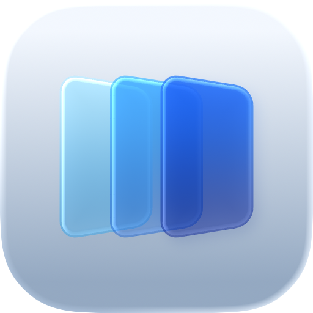

<p align="center">
  <picture>
    <source media="(prefers-color-scheme: dark)" srcset="docs/assets/defi-icon-dark.png">
    <source media="(prefers-color-scheme: light)" srcset="docs/assets/defi-icon-light.png">
    
  </picture>
</p>

<h1 align="center">Defi</h1>

<p align="center">A scrolling window manager for macOS.</p>

<p align="center">
  Apple Silicon · macOS 26+ · Alpha
</p>

<p align="center">
  <a href="#get-started">Get started</a> ·
  <a href="CONFIGURATION.md">Configuration</a> ·
  <a href="CONTRIBUTING.md">Contributing</a>
</p>

<!-- Add the approved continuous demo here once its hosting is settled. -->

Defi arranges your windows in columns on a horizontal strip. Open another
window and the strip grows. Move to a window beyond the edge of your screen
and the desktop scrolls to bring it into view.

Inspired by [Niri](https://github.com/YaLTeR/niri), built for native macOS
windows. Click a window, select it in the Dock, or use Command-Tab as usual.

## How it works

- Arrange windows side by side, stack them vertically, and adjust each column's
  width. Keep floating windows for apps that need their own space.
- Give each monitor its own workspaces. An empty workspace is always ready;
  keep named ones for projects or recurring tasks.
- Open Overview to see your workspaces, pick a window, or move it to another
  workspace.
- Navigate and rearrange with the keyboard. Hold your shortcut modifier to see
  the available commands.

## Get started

Defi supports **Apple Silicon Macs running macOS 26 or newer**.
The first public `v0.2.0-alpha` package is being prepared. For now, follow the
[build from source guide](CONTRIBUTING.md#build-and-run).

The alpha is experimental. Behavior and configuration may change before the
first stable release.

On first launch, grant Defi **Accessibility** access in System Settings, then
quit and reopen it. Defi needs this permission to focus and arrange windows.
Screen Recording is only needed if you enable window previews in Overview.

Enable **Launch at Login** in the menu bar if you want Defi to start with macOS.

## Keyboard controls

Built-in shortcuts use Option. Hold Option on its own to show the shortcut
guide, or start with these:

| Action | Shortcut |
| --- | --- |
| Focus a column | Option + ← / → |
| Switch workspace | Option + ↑ / ↓ |
| Focus a window in a stack | Option + J / K |
| Move a column left or right | Option + Shift + ← / → |
| Move a column to another workspace | Option + Shift + ↑ / ↓ |
| Cycle column width | Option + − / = |
| Toggle full column width | Option + F |
| Open Overview | Option + O |

I recommend mapping a key such as Caps Lock to a **Hyper key** to avoid
conflicts with macOS and application shortcuts. Set
[`default_key_modifier`](CONFIGURATION.md#default_key_modifier) to match
your combination.

## Configuration

Defi works without a config file. Add overrides to
`~/.config/defi/config.toml` for gaps, shortcuts, named workspaces, and app rules.

Existing config files are preserved when you rebuild or update Defi.
Defi creates the config directory if needed, but no config file.
Changes reload automatically when you save, including your first config. The
[example configuration](config.example.toml) is the maintainer's setup;
copy only the parts you want.

[Configuration and commands](CONFIGURATION.md) ·
[SketchyBar integration](SKETCHYBAR.md)

<details>
<summary>Command-line control</summary>

The CLI is bundled with the app. For a source installation:

```sh
~/Applications/Defi.app/Contents/MacOS/defi status
~/Applications/Defi.app/Contents/MacOS/defi focus-column right
~/Applications/Defi.app/Contents/MacOS/defi workspace dev
```

The last command requires a named workspace called `dev`.
Use `/Applications/Defi.app` instead if that is where you installed Defi.
See the [command reference](CONFIGURATION.md#commands) for the full list.

</details>

<details>
<summary>Uninstall completely</summary>

Run the CLI from your installed app:

```sh
~/Applications/Defi.app/Contents/MacOS/defi uninstall --purge
```

Use `/Applications/Defi.app` instead for an app installed there.
This removes the app containing the invoked CLI, plus Defi's shared
configuration, saved workspace state, logs, login item, and privacy permissions.
Other Defi app bundles are preserved, but they share the removed user data.

</details>

## Troubleshooting

If shortcuts do not respond, check Accessibility permission for the installed
Defi app, then quit and reopen it. Check `default_key_modifier` in your config:
custom Hyper bindings require a matching keyboard remap. Temporarily quit
other window managers to rule out conflicting shortcuts or window moves.

To stop Defi, choose **Quit Defi** in the menu bar. If the menu is unavailable,
run `~/Applications/Defi.app/Contents/MacOS/defi quit`, or quit `defi-daemon`
through Activity Monitor. Adjust the app path for an installation in
`/Applications`.

For a bug report, include your Defi and macOS versions, affected apps, monitor
setup, and steps to reproduce. The bundled CLI's `status` and `trace` commands
can help explain what happened. Review their output, config snippets, and
recordings before posting: they may expose window titles, paths, workspace
names, or other private information. Share only the relevant, redacted parts.

### Alpha limitations

Defi manages its own virtual workspaces, not native macOS Spaces. Apps can
impose window size constraints or expose limited Accessibility support, so
please report app-specific behavior. Screen Recording is optional; Overview
window previews are off by default. There is no automatic update checker yet.

## Contribute

Bug reports and focused pull requests are welcome.
See [Contributing](CONTRIBUTING.md) for setup and checks, or
[open an issue](https://github.com/qeude/Defi/issues/new/choose) to report a
problem or propose an improvement.

[MIT License](LICENSE)
